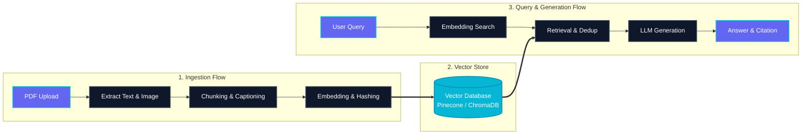

# RAG Chatbot
## AI Knowledge Assistant for Multimodal PDF Collections

:::badges
[badge-primary: Nhóm 3]
[badge-accent: Streamlit + LangChain]
[badge-emerald: Pinecone + ChromaDB]
[badge: Vision AI & aHash]
:::

:::stats
:::stat 1,529 | Test Questions :::
:::stat 85.74% | Baseline Accuracy :::
:::stat 2 DBs | Cloud + Local Fallback :::
:::

Note: Chào mừng thầy cô và các bạn. Nhóm 3 xin trình bày đề tài RAG Chatbot – Trợ lý tri thức AI đa năng dành cho các tập tài liệu PDF.

---

## 🎯 Problem & Value Proposition

:::callout
Useful knowledge is locked inside complex PDFs with tables, figures, and diagrams. Lexical search misses semantics; general LLMs hallucinate.
:::

:::grid
:::box
### 🔍 Hybrid Semantic Search
Combines dense vector embeddings with BM25 sparse keywords to find relevant passages even when wording differs.
:::
:::box
### 🖼️ Multimodal PDF Ingestion
Extracts text & visual elements (charts, diagrams) using PyMuPDF, Gemini Vision captioning, and perceptual hashing (aHash).
:::
:::box
### 🛡️ Grounded & Traceable
Answers strictly from retrieved PDF context with document name and exact page number citations.
:::
:::

Note: Trình bày bài toán thực tế và 3 giá trị cốt lõi mà dự án giải quyết: Tìm kiếm lai (Hybrid), xử lý đa phương thức (văn bản + ảnh), và câu trả lời luôn có trích dẫn nguồn (grounded).

---

## 🏗️ System Architecture

:::callout
Dual-flow architecture separating Admin Ingestion from User Query & Generation.
:::

Note: Đây là sơ đồ kiến trúc tổng thể. Nhấn mạnh luồng Nhập liệu (Ingestion) ở bên trái và luồng Hỏi đáp (Query) ở bên phải, kết nối qua Vector Database ở trung tâm.

---

## 💾 Dual Vector DB & Fallback Engine

:::grid
:::box
### 🌲 Pinecone Cloud
Cloud-hosted Hybrid Search combining dense vector embeddings with BM25 sparse keyword scores for maximum accuracy.
:::
:::box
### ⚡ ChromaDB Local
Zero-config local persistent vector store (`./chroma_db/`) executing fully offline without cloud API keys.
:::
:::box
### 🔄 Seamless Fallback
Automatic connection detection: falls back to ChromaDB if Pinecone is offline or credentials are missing.
:::
:::box
### 📸 Perceptual Image Hashing
Average hashing (`aHash`) & Hamming distance matching for instant visual similarity search across PDF figures.
:::
:::

Note: Giải thích tính năng tự động chuyển đổi CSDL (Fallback) giúp ứng dụng hoạt động bền vững ngay cả khi mất kết nối cloud.

---

## 💬 Live Demo: Text Q&A & Verification

:::callout
Sample benchmark questions verified against `question.csv` and `evaluation_results.csv`:
:::

| Benchmark Question | Selected Answer | Ground Truth | Verification Status |
| --- | --- | --- | --- |
| **Cơ chế lưu trữ siêu tụ điện?** | **B** (Tích tụ ion bề mặt) | **B** | [badge-emerald: Verified 100%] |
| **Pixel ảnh xám (Min/Max)?** | **C** (0 và 255) | **C** | [badge-emerald: Verified 100%] |
| **Cao độ dung dịch khoan (-10m)?** | **B** (-8.5 m) | **B** | [badge-emerald: Verified 100%] |
| **Kích thước khóa DES?** | **B** (56 bit) | **B** | [badge-emerald: Verified 100%] |
| **Cảm biến robot điều chỉnh lực?** | **D** (Xúc giác & lực) | **D** | [badge-emerald: Verified 100%] |

Note: Tiến hành demo trực tiếp câu hỏi trên Chat UI. Đưa ra minh chứng từ file log CSV và phần Citation hiển thị dưới câu trả lời.

---

## 🧪 Visual Search & Concurrent Evaluation

:::grid
:::box
### 🖼️ Image-Based Query Scenario
- Upload a cropped chart (`test_crop.png`).
- System computes `aHash`, locates original image in DB, retrieves Gemini caption.
- LLM generates context-aware answer from visual evidence.
:::
:::box
### ⚡ High-Throughput Evaluation
- Admin UI runner supporting up to **20 concurrent worker threads**.
- Timestamped accuracy tracking stored in `evaluation_results_metadata.json`.
- Per-question diagnostics and failure logging.
:::
:::

Note: Demo tính năng chat bằng hình ảnh và phần Admin Evaluation chạy đa luồng 20 workers.

---

## 📊 Governance, Cost & 3D Visualization

:::stats
:::stat $9.00 | Cost Warning Threshold :::
:::stat Async | LangChain Usage Callbacks :::
:::stat 3D PCA | Vector Embedding Galaxy :::
:::

:::grid
:::box
### 💰 Token & Cost Tracking
Persistent usage tracking saved in `usage_log.json` with per-model token breakdowns and a `$9.00` warning threshold alert.
:::
:::box
### 🌌 Interactive 3D/2D Galaxy
Explore vector embedding spaces using 3D PCA, 2D t-SNE scatter plots, and network graphs directly in Streamlit.
:::
:::

Note: Trình bày về tính năng theo dõi chi phí API và công cụ trực quan hóa không gian Vector 3D.

---

# 🚀 Thank You!
### Open for Q&A

:::badges
[badge-primary: Team 3 Presentation]
[badge-accent: Press N for Speaker Notes]
[badge-emerald: Press O for Slide Grid]
[badge: Press F for Fullscreen]
:::

Note: Cảm ơn thầy cô và các bạn. Mời thầy cô và các bạn đặt câu hỏi cho Nhóm 3.
