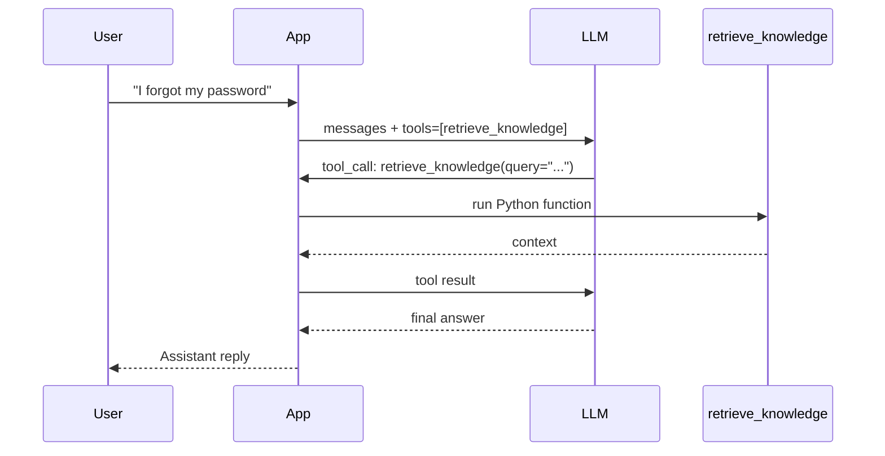

# Workshop 02: Function Calling

## Objectives

In this workshop, the chatbot does not answer directly from knowledge baked into the prompt. Instead, the LLM **decides on its own** when to look up the knowledge base through **function calling** (tool calling).


## Overall flow



## Step-by-step breakdown

### 1. User sends a question

The user enters a question in the CLI, for example: `"I forgot my password"`.

The app appends the message to the conversation history:

```python
{"role": "user", "content": "I forgot my password"}
```

### 2. App calls the LLM with a list of tools

The app sends the full `messages` (system + history) along with the `retrieve_knowledge` tool schema:

```python
client.chat.completions.create(
    model=model,
    messages=messages,
    tools=[RETRIEVE_KNOWLEDGE_TOOL],
)
```

The LLM reads the question and the tool description, then decides whether a knowledge base lookup is needed.

### 3. LLM returns a tool_call

If a lookup is needed, the LLM does **not** return text immediately. Instead, the response contains `tool_calls`, for example:

```json
{
  "name": "retrieve_knowledge",
  "arguments": "{\"query\": \"password reset forgot password\"}"
}
```

### 4. App executes the Python function

The app parses `arguments`, calls `run_tool()`, then runs `retrieve_knowledge(query)`:

- Extract keywords from `query`
- Match against `KNOWLEDGE_BASE`
- Return context with source citations

For a password-related question, the function returns content from the **IT Support Guide**.

### 5. App sends the tool result back to the LLM

The app appends 2 messages to the history:

1. Assistant message (containing `tool_calls`)
2. Tool message (containing the lookup result)

```python
{
    "role": "tool",
    "tool_call_id": tool_call.id,
    "content": "Source: IT Support Guide\nContent: ..."
}
```

### 6. LLM generates the final answer

The app calls the LLM again with the updated history. This time the LLM has context from the knowledge base and returns text for the user.

The loop in `get_assistant_reply()` repeats until the LLM no longer returns `tool_calls`.

## End-to-end example

**Input:**

```
You: i forgot my password
```

| Step | Actor | Action |
|---|---|---|
| 1 | User | Sends the question |
| 2 | LLM | Returns `tool_call: retrieve_knowledge(query="password reset")` |
| 3 | App | Runs `retrieve_knowledge()` → matches IT Support Guide |
| 4 | LLM | Receives context, generates password reset instructions |
| 5 | User | Receives an answer citing IT Support Guide |

**Output:**

```
Assistant: If you have forgotten your password, you can follow these steps:

1. **Reset Password**: Go to the company account portal to reset your password.
2. **Phone Support**: Alternatively, you can call IT support at +84-98-123-1234 for assistance.
3. **Account Lock**: If your account remains locked after attempting to reset, please contact IT support.

If you need any further assistance, feel free to ask!
```

## Test cases

Run the prototype with `python test.py`, then try the inputs below. LLM wording may vary, but the answer should follow the expected behavior.

| # | Input | Expected source | Expected behavior |
|---|---|---|---|
| 1 | `i forgot my password` | IT Support Guide | Mentions password reset via company account portal and/or IT phone number `+84-98-123-1234` |
| 2 | `my account is locked` | IT Support Guide | Advises contacting IT support if the account remains locked |
| 3 | `how many annual leave days do I get?` | Leave Policy | States 15 days of annual leave per year |
| 4 | `how do I request vacation?` | Leave Policy | Mentions submitting leave requests to the manager at least 3 working days in advance |
| 5 | `what should I do on my first day?` | Employee Onboarding | Covers HR documents, security training, account setup, and first-day orientation |
| 6 | `onboarding checklist for new employees` | Employee Onboarding | Summarizes onboarding steps from the knowledge base |
| 7 | `what is the company stock price?` | None | States that the information could not be found; does not invent company policies |
| 8 | `hello` | None (optional) | May greet the user without calling `retrieve_knowledge`, or answer without citing a document source |


### Notes

- Cases 1–6 should trigger `retrieve_knowledge` in most runs.
- Case 7 should return no match from `retrieve_knowledge`; the LLM should acknowledge the limitation per the system prompt.
- Case 8 is optional — behavior depends on whether the LLM decides a lookup is needed for a simple greeting.
